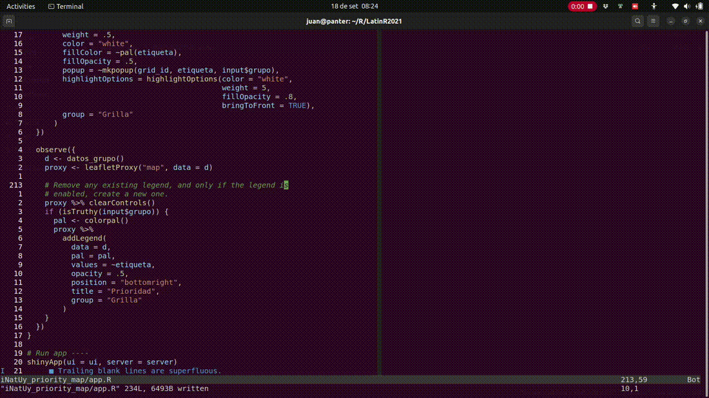
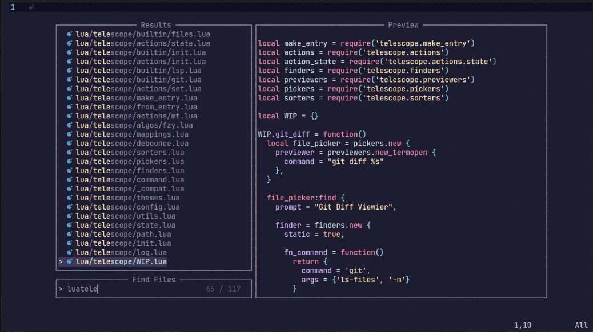

<div align="center">

# TOC Navigator for NeoVim

##### Big source files made easy...

[](http://www.lua.org)
[](https://neovim.io)
</div>

Plugin neovim for making a TOC navigator, similar to the one in RStudio



## WIP

First time creating a neovim plugin.

It is a very simple plugin, and it currently works well enough in a very limited set of examples from my personal work. It doesn't use any dependency, which is good, but also makes it more plain.

## Motivation

I'm an R programmer, and I use RStudio a lot. A key feature that makes my life much easier when using this IDE is the [RStudio document outlines](https://www.natedayta.com/2019/12/25/owning-outlines-in-rstudio/)

That is, the ability to create bookmarks in a file by way of formatting some comments in a certain way:

```r
# 1 Import ----

# * 1.1 Databases ----

# * * 1.1.1 Postgres ----
```

A big shoutout to this great tutorial into creating neovim plugins: [How to write neovim plugins in Lua](https://dev.to/2nit/how-to-write-neovim-plugins-in-lua-5cca) (by Rafał Camlet), which is where I started this.

Other inspirations:

- [telescope.nvim](https://github.com/nvim-telescope/telescope.nvim)

- [harpoon.nvim](https://github.com/ThePrimeagen/harpoon)


## Installation

* neovim 0.5.0+ required

This is my current installed version:

```
NVIM v0.9.1
Build type: Release
LuaJIT 2.1.0-beta3
```

* install using your favorite plugin manager ([`packer.nvim`](https://github.com/wbthomason/packer.nvim) in this example)

```lua
use ("jumanbar/tocnavigator.nvim")
```

To run the main function, `toggle_toc_navigator`, this command should work:

```vim
:lua require("tocnavigator").toggle_toc_navigator()
```

## Setup

A more convenient way to use it, is with a remap:

```lua
local n = require("tocnavigator")
vim.keymap.set("n", "<leader>n", n.toggle_toc_navigator)
```

## To do

- Make it capable of telling sections from subsections (like [current day RStudio, apparently](https://posit.co/blog/rstudio-v1-4-preview-little-things/))
- Markdown: this is an exception, so instead of using the `vim.bo.commentstring` variable, it should just use `#`


- Telescope-like features? A **Preview** window would be amazing:




- Isn't it more smart to find comments using treesitter or something similar? I don't know how to do that, or even if it is possible.
